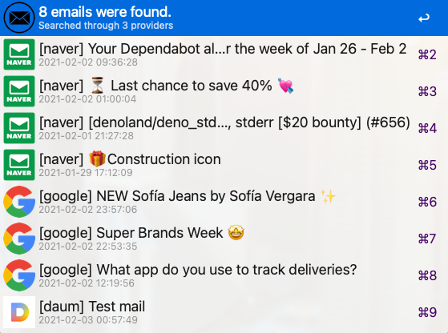

# ✉️ alfred-unseen-email-fetcher


Fetchs unseen emails through imap

<p align="center">

</p>

## 📌 Prerequisite

* Node JS

* [Alfred powerpack](https://www.alfredapp.com/powerpack/)

##  🔨 How to install

1. Install package by npm

```
$ npm install --global alfred-multiple-emails
```

2. Run `em > config` and setup account settings

3. Set the imap settings for the account you added.
You can refer to the [documents](https://github.com/jopemachine/alfred-multiple-emails/tree/master/documents)


## 📍 Configuration

You can configure detailed settings by editing your `config.json`.

```json
{
    "autoMarkSeen": false,
    "providerPrefix": true,
    "subtitle": "date",
    "cacheDuration": false,
    "sorting": "providerAndTime",
    "usingHtmlCache": true,
    "accounts": {
        "google": {
            "url": "https://mail.google.com/mail/",
            "enabled": true,
            "icon": "./icons/google.png",
            "imap": {
                "user": "user@gmail.com",
                "password": "some_password",
                "host": "imap.gmail.com",
                "port": 993,
                "tls": true,
                "authTimeout": 3000
            }
        },
        "naver": {
            "url": "https://mail.naver.com/",
            "enabled": true,
            "icon": "./icons/naver.png",
            "imap": {
                "user": "user@naver.com",
                "password": "some_password",
                "host": "imap.naver.com",
                "port": 993,
                "tls": true,
                "authTimeout": 3000
            }
        }
    }
}
```
### autoMarkSeen

Type: `Boolean`

Mark seen when fetch emails

### providerPrefix

Type: `Boolean`

Append email provider name to email record.

### subtitle

Type: `String (enum)`

`date` or `from`.

### cacheDuration

Type: `Number | Boolean`

set cache period.

To not use caching, set this value to `false`

### sorting

Type: `String (enum)`

Sorts and returns search results.

`subject` (mail title) or `providerAndSubject` (sort provider first and subject) or `timeDesc` or `timeAsec` or `providerAndTimeAsec` or `providerAndTimeDesc` 

### usingHtmlCache

Type: `Boolean`

save and use html cache for quicklook feature

### accounts

Type: `Array of object`

You can register multiple email accounts.

This workflow create one imap connection per each account,

so, if you connect too many accounts or there are too many emails to fetch, response will slow down.

#### url

Type: `String`

open this url when press enter on the email record.

#### enabled

Type: `Boolean`

if this value is false, skip this account

#### icon

Type: `String`

show this path's icon on this account's emails

#### imap

Type: `Object`

imap configuration object used by [imap-simple](https://github.com/chadxz/imap-simple).


## 📗 How to use

### emu { Argument }

Fetch and show emails on `UNSEEN` state from registered accounts.

### em > config

Open the `config.json` file through your editor.

